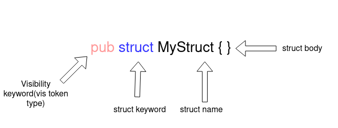

In this tutorial, we’ll cover everything you need to know about Rust macros, including an introduction to macros in Rust and a demonstration of how to use Rust macros with examples.

We’ll cover the following:

- What are Rust macros?
- Types of macros in Rust
- Declarative macros in Rust
  - Creating declarative macros
  - Advanced parsing in Rust with declarative macros
  - Parsing the name and field of a struct
  - Parsing metadata from the struct
  - Limitations of declarative macros

- Procedural macros in Rust
  - Attribute-like macros
  - Custom derive macros
  - Function-like macros

## What are Rust macros?

Rust has excellent support for macros. Macros enable you to write code that writes other code, which is known as metaprogramming.

Macros provide functionality similar to functions but without the runtime cost. There is some compile-time cost, however, since macros are expanded during compile time.

Rust macros are very different from macros in C. Rust macros are applied to the token tree whereas C macros are text substitution.

## Types of macros in Rust

Rust has two types of macros:

1. **Declarative macros** enable you to write something similar to a match expression that operates on the Rust code you provide as arguments. It uses the code you provide to generate code that replaces the macro invocation

2. **Procedural macros** allow you to operate on the abstract syntax tree (AST) of the Rust code it is given. A proc macro is a function from a `TokenStream` (or two) to another `TokenStream`, where the output replaces the macro invocation

## Declarative macros in Rust

These macros are declared using `macro_rules!`. Declarative macros are a bit less powerful but provide an easy to use interface for creating macros to remove duplicate code. One of the common declarative macro is `println!`. Declarative macros provide a `match` like an interface where on match the macro is replaced with code inside the matched arm.

## Creating declarative macros

```rust
// use macro_rules! <name of macro>{<Body>}
macro_rules! add{
 // macth like arm for macro
    ($a:expr,$b:expr)=>{
 // macro expand to this code
        {
// $a and $b will be templated using the value/variable provided to macro
            $a+$b
        }
    }
}

fn main(){
 // call to macro, $a=1 and $b=2
    add!(1,2);
}
```

This code creates a macro to add two numbers. [`macro_rules!`](https://doc.rust-lang.org/rust-by-example/macros.html) are used with the name of the macro, `add`, and the body of the macro.

The macro doesn’t add two numbers, it just replaces itself with the code to add two numbers. Each arm of the macro takes an argument for functions and multiple types can be assigned to arguments. If the `add` function can also take a single argument, we add another arm.

```rust
macro_rules! add{
 // first arm match add!(1,2), add!(2,3) etc
    ($a:expr,$b:expr)=>{
        {
            $a+$b
        }
    };
// Second arm macth add!(1), add!(2) etc
    ($a:expr)=>{
        {
            $a
        }
    }
}

fn main(){
// call the macro
    let x=0;
    add!(1,2);
    add!(x);
}
```

There can be multiple branches in a single macro expanding to different code based on different arguments. Each branch can take multiple arguments, starting with the `$` sign and followed by a token type:

- `item` — an item, like a function, struct, module, etc.
- `block` — a block (i.e. a block of statements and/or an expression, surrounded by braces)
- `stmt` — a statement
- `pat` — a pattern
- `expr` — an expression
- `ty` — a type
- `ident` — an identifier
- `path` — a path (e.g., `foo`, `::std::mem::replace`, `transmute::<_, int>`, …)
- `meta` — a meta item; the things that go inside #[...] and #![...] attributes
- `tt` — a single token tree
- `vis` — a possibly empty `Visibility` qualifier

In the example, we use the `$typ` argument with token type `ty` as a datatype like `u8`, `u16`, etc. This macro converts to a particular type before adding the numbers.

```rust
macro_rules! add_as{
// using a ty token type for macthing datatypes passed to maccro
    ($a:expr,$b:expr,$typ:ty)=>{
        $a as $typ + $b as $typ
    }
}

fn main(){
  println!("{}",add_as!(0,2,u8));
}
```

Rust macros also support taking a nonfixed number of arguments. The operators are very similar to the regular expression. `*` is used for zero or more token types and `+` for zero or one argument.

```rust
macro_rules! add_as{
    (
  // repeated block
  $($a:expr)
 // seperator
   ,
// zero or more
   *
   )=>{
       {
   // to handle the case without any arguments
   0
   // block to be repeated
   $(+$a)*
     }
    }
}

fn main(){
    println!("{}",add_as!(1,2,3,4)); // => println!("{}",{0+1+2+3+4})
}
```

The token type that repeats is enclosed in `$()`, followed by a separator and a `*` or a `+`, indicating the number of times the token will repeat. The separator is used to distinguish the tokens from each other. The `$()` block followed by `*` or `+` is used to indicate the repeating block of code. In the above example, `+$a` is a repeating code.

If you look closely, you’ll notice an additional zero is added to the code to make the syntax valid. To remove this zero and make the `add` expression the same as the argument, we need to create a new macro known as [TT muncher](https://danielkeep.github.io/tlborm/book/pat-incremental-tt-munchers.html).

```rust
macro_rules! add{
 // first arm in case of single argument and last remaining variable/number
    ($a:expr)=>{
        $a
    };
// second arm in case of two arument are passed and stop recursion in case of odd number ofarguments
    ($a:expr,$b:expr)=>{
        {
            $a+$b
        }
    };
// add the number and the result of remaining arguments
    ($a:expr,$($b:tt)*)=>{
       {
           $a+add!($($b)*)
       }
    }
}

fn main(){
  println!("{}",add!(1,2,3,4));
}
```

The TT muncher processes each token separately in a recursive fashion. It’s easier to process a single token at a time. The macro has three arms:

1. The first arms handle the case if a single argument is passed
2. The second one handles the case if two arguments are passed
3. The third arm calls the `add` macro again with the rest of the arguments

The macro arguments don’t need to be comma-separated. Multiple tokens can be used with different token types. For example, brackets can be used with the `ident` token type. The Rust compiler takes the matched arm and extracts the variable from the argument string.

```rust
macro_rules! ok_or_return{
// match something(q,r,t,6,7,8) etc
// compiler extracts function name and arguments. It injects the values in respective varibles.
    ($a:ident($($b:tt)*))=>{
       {
        match $a($($b)*) {
            Ok(value)=>value,
            Err(err)=>{
                return Err(err);
            }
        }
        }
    };
}

fn some_work(i:i64,j:i64)->Result<(i64,i64),String>{
    if i+j>2 {
        Ok((i,j))
    } else {
        Err("error".to_owned())
    }
}

fn main()->Result<(),String>{
    ok_or_return!(some_work(1,4));
    ok_or_return!(some_work(1,0));
    Ok(())
}
```

The `ok_or_return` macro returns the function if an operation returns `Err` or the value of an operation returns `Ok`. It takes a function as an argument and executes it inside a match statement. For arguments passed to function, it uses repetition.

Often, few macros need to be grouped into a single macro. In these cases, internal macro rules are used. It helps to manipulate the macro inputs and write clean TT munchers.

To create an internal rule, add the rule name starting with `@` as the argument. Now the macro will never match for an internal rule until explicitly specified as an argument.

```rust
macro_rules! ok_or_return{
 // internal rule.
    (@error $a:ident,$($b:tt)* )=>{
        {
        match $a($($b)*) {
            Ok(value)=>value,
            Err(err)=>{
                return Err(err);
            }
        }
        }
    };

// public rule can be called by the user.
    ($a:ident($($b:tt)*))=>{
        ok_or_return!(@error $a,$($b)*)
    };
}

fn some_work(i:i64,j:i64)->Result<(i64,i64),String>{
    if i+j>2 {
        Ok((i,j))
    } else {
        Err("error".to_owned())
    }
}

fn main()->Result<(),String>{
   // instead of round bracket curly brackets can also be used
    ok_or_return!{some_work(1,4)};
    ok_or_return!(some_work(1,0));
    Ok(())
}
```

## Advanced parsing in Rust with declarative macros

Macros sometimes perform tasks that require parsing of the Rust language itself.

Do put together all the concepts we’ve covered to this point, let’s create a macro that makes a struct public by suffixing the `pub` keyword.

First, we need to parse the Rust struct to get the name of the struct, fields of the struct, and field type.

## Parsing the name and field of a struct

A `struct` declaration has a visibility keyword at the start (such as `pub`), followed by the `struct` keyword and then the name of the `struct` and the body of the `struct`.



```rust
macro_rules! make_public{
    (
  // use vis type for visibility keyword and ident for struct name
     $vis:vis struct $struct_name:ident { }
    ) => {
        {
            pub struct $struct_name{ }
        }
    }
}
```

The `$vis` will have visibility and `$struct_name` will have a struct name. To make a struct public, we just need to add the `pub` keyword and ignore the `$vis` variable.


A `struct` may contain multiple fields with the same or different data types and visibility. The `ty` token type is used for the data type, `vis` for visibility, and `ident` for the field name. We’ll use `*` repetition for zero or more fields.

```rust
macro_rules! make_public{
    (
     $vis:vis struct $struct_name:ident {
        $(
 // vis for field visibility, ident for field name and ty for field data type
        $field_vis:vis $field_name:ident : $field_type:ty
        ),*
    }
    ) => {
        {
            pub struct $struct_name{
                $(
                pub $field_name : $field_type,
                )*
            }
        }
    }
}
```

### Parsing metadata from the `struct`

Often the `struct` has some metadata attached or procedural macros, such as `#[derive(Debug)]`. This metadata needs to stay intact. Parsing this metadata is done using the `meta` type.

```rust
macro_rules! make_public{
    (
     // meta data about struct
     $(#[$meta:meta])*
     $vis:vis struct $struct_name:ident {
        $(
        // meta data about field
        $(#[$field_meta:meta])*
        $field_vis:vis $field_name:ident : $field_type:ty
        ),*$(,)+
    }
    ) => {
        {
            $(#[$meta])*
            pub struct $struct_name{
                $(
                $(#[$field_meta:meta])*
                pub $field_name : $field_type,
                )*
            }
        }
    }
}
```

Our `make_public` macro is ready now. To see how `make_public` works, let’s use Rust Playground to expand the macro to the actual code that is compiled.

```rust
macro_rules! make_public{
    (
     $(#[$meta:meta])*
     $vis:vis struct $struct_name:ident {
        $(
        $(#[$field_meta:meta])*
        $field_vis:vis $field_name:ident : $field_type:ty
        ),*$(,)+
    }
    ) => {

            $(#[$meta])*
            pub struct $struct_name{
                $(
                $(#[$field_meta:meta])*
                pub $field_name : $field_type,
                )*
            }
    }
}

fn main(){
    make_public!{
        #[derive(Debug)]
        struct Name{
            n:i64,
            t:i64,
            g:i64,
        }
    }
}
```

The expanded code looks like this:

```rust
// some imports

macro_rules! make_public {
    ($ (#[$ meta : meta]) * $ vis : vis struct $ struct_name : ident
     {
         $
         ($ (#[$ field_meta : meta]) * $ field_vis : vis $ field_name : ident
          : $ field_type : ty), * $ (,) +
     }) =>
    {

            $ (#[$ meta]) * pub struct $ struct_name
            {
                $
                ($ (#[$ field_meta : meta]) * pub $ field_name : $
                 field_type,) *
            }
    }
}

fn main() {
        pub struct name {
            pub n: i64,
            pub t: i64,
            pub g: i64,
    }
}
```

## Limitations of declarative macros

Declarative macros have a few limitations. Some are related to Rust macros themselves while others are more specific to declarative macros.

- Lack of support for macros autocompletion and expansion
- Debugging declarative macros is difficult
- Limited modification capabilities
- Larger binaries
- Longer compile time (this applies to both declarative and procedural macros)

## Procedural macros in Rust

[Procedural macros](https://blog.logrocket.com/procedural-macros-in-rust/) are a more advanced version of macros. Procedural macros allow you to expand the existing syntax of Rust. It takes arbitrary input and returns valid Rust code.

Procedural macros are functions that take a `TokenStream` as input and return another `Token Stream`. Procedural macros manipulate the input `TokenStream` to produce an output stream.

There are three types of procedural macros:

1. Attribute-like macros
2. Derive macros
3. Function-like macros

We’ll go into each procedural macro type in detail below.

### Attribute-like macros

Attribute-like macros enable you to create a custom attribute that attaches itself to an item and allows manipulation of that item. It can also take arguments.

```rust
#[some_attribute_macro(some_argument)]
fn perform_task(){
// some code
}
```

In the above code, `some_attribute_macros` is an attribute macro. It manipulates the function `perform_task`.

To write an attribute-like macro, start by creating a project using `cargo new macro-demo --lib`. Once the project is ready, update the `Cargo.toml` to notify cargo the project will create procedural macros.

```toml
# Cargo.toml
[lib]
proc-macro = true
```

Now we are all set to venture into procedural macros.

Procedural macros are public functions that take `TokenStream` as input and return another `TokenStream`. To write a procedural macro, we need to write our parser to parse `TokenStream`. The Rust community has a very good crate, `syn`, for parsing `TokenStream`.

[syn](https://docs.rs/syn/1.0.53/syn/) provides a ready-made parser for Rust syntax that can be used to parse TokenStream. You can also parse your syntax by combining low-level parsers providing `syn`.

Add `syn` and `quote` to `Cargo.toml`:

```toml
# Cargo.toml
[dependencies]
syn = {version="1.0.57",features=["full","fold"]}
quote = "1.0.8"
```

Now we can write an attribute-like a macro in `lib.rs` using the `proc_macro` crate provided by the compiler for writing procedural macros. A procedural macro crate cannot export anything else other than procedural macros and procedural macros defined in the crate can’t be used in the crate itself.

```rust
// lib.rs
extern crate proc_macro;
use proc_macro::{TokenStream};
use quote::{quote};

// using proc_macro_attribute to declare an attribute like procedural macro
#[proc_macro_attribute]
// _metadata is argument provided to macro call and _input is code to which attribute like macro attaches
pub fn my_custom_attribute(_metadata: TokenStream, _input: TokenStream) -> TokenStream {
    // returing a simple TokenStream for Struct
    TokenStream::from(quote!{struct H{}})
}
```

To test the macro we added, create an ingratiation test by creating a folder named `tests` and adding the file `attribute_macro.rs` in the folder. In this file, we can use our attribute-like macro for testing.

```rust
// tests/attribute_macro.rs

use macro_demo::*;

// macro converts struct S to struct H
#[my_custom_attribute]
struct S{}

#[test]
fn test_macro(){
// due to macro we have struct H in scope
    let demo=H{};
}
```

Run the above test using the `cargo test` command.

Now that we understand the basics of procedural macros, lets use `syn` for some advanced `TokenStream` manipulation and parsing.

To learn how `syn` is used for parsing and manipulation, let’s take an example from the [syn GitHub repo](https://github.com/dtolnay/syn/blob/master/examples/trace-var/trace-var/src/lib.rs). This example creates a Rust macro that trace variables when value changes.

First, we need to identify how our macro will manipulate the code it attaches.

```rust
#[trace_vars(a)]
fn do_something(){
  let a=9;
  a=6;
  a=0;
}
```

The `trace_vars` macro takes the name of the variable it needs to trace and injects a print statement each time the value of the input variable i.e a changes. It tracks the value of input variables.

First, parse the code to which the attribute-like macro attaches. syn provides an inbuilt parser for Rust function syntax. `ItemFn` will parse the function and throw an error if the syntax is invalid.

```rust
#[proc_macro_attribute]
pub fn trace_vars(_metadata: TokenStream, input: TokenStream) -> TokenStream {
// parsing rust function to easy to use struct
    let input_fn = parse_macro_input!(input as ItemFn);
    TokenStream::from(quote!{fn dummy(){}})
}
```

Now that we have the parsed `input`, let’s move to `metadata`. For `metadata`, no inbuilt parser will work, so we’ll have to write one ourselves using `syn`‘s `parse` module.

```rust
#[trace_vars(a,c,b)] // we need to parse a "," seperated list of tokens
// code
```

For `syn` to work, we need to implement the `Parse` trait provided by `syn`. `Punctuated` is used to create a `vector` of `Indent` separated by `,`.

```rust
struct Args{
    vars:HashSet<Ident>
}

impl Parse for Args{
    fn parse(input: ParseStream) -> Result<Self> {
        // parses a,b,c, or a,b,c where a,b and c are Indent
        let vars = Punctuated::<Ident, Token![,]>::parse_terminated(input)?;
        Ok(Args {
            vars: vars.into_iter().collect(),
        })
    }
}
```

Once we implement the `Parse` trait, we can use `parse_macro_input` macro for parsing `metadata`.

```rust
#[proc_macro_attribute]
pub fn trace_vars(metadata: TokenStream, input: TokenStream) -> TokenStream {
    let input_fn = parse_macro_input!(input as ItemFn);
// using newly created struct Args
    let args= parse_macro_input!(metadata as Args);
    TokenStream::from(quote!{fn dummy(){}})
}
```

We will now modify the `input_fn` to add `println!` when the variable changes the value. To add this, we need to filter outlines that have an assignment and insert a print statement after that line.

```rust
impl Args {
    fn should_print_expr(&self, e: &Expr) -> bool {
        match *e {
            Expr::Path(ref e) => {
 // variable shouldn't start wiht ::
                if e.path.leading_colon.is_some() {
                    false
// should be a single variable like `x=8` not n::x=0
                } else if e.path.segments.len() != 1 {
                    false
                } else {
// get the first part
                    let first = e.path.segments.first().unwrap();
// check if the variable name is in the Args.vars hashset
                    self.vars.contains(&first.ident) && first.arguments.is_empty()
                }
            }
            _ => false,
        }
    }

// used for checking if to print let i=0 etc or not
    fn should_print_pat(&self, p: &Pat) -> bool {
        match p {
// check if variable name is present in set
            Pat::Ident(ref p) => self.vars.contains(&p.ident),
            _ => false,
        }
    }

// manipulate tree to insert print statement
    fn assign_and_print(&mut self, left: Expr, op: &dyn ToTokens, right: Expr) -> Expr {
 // recurive call on right of the assigment statement
        let right = fold::fold_expr(self, right);
// returning manipulated sub-tree
        parse_quote!({
            #left #op #right;
            println!(concat!(stringify!(#left), " = {:?}"), #left);
        })
    }

// manipulating let statement
    fn let_and_print(&mut self, local: Local) -> Stmt {
        let Local { pat, init, .. } = local;
        let init = self.fold_expr(*init.unwrap().1);
// get the variable name of assigned variable
        let ident = match pat {
            Pat::Ident(ref p) => &p.ident,
            _ => unreachable!(),
        };
// new sub tree
        parse_quote! {
            let #pat = {
                #[allow(unused_mut)]
                let #pat = #init;
                println!(concat!(stringify!(#ident), " = {:?}"), #ident);
                #ident
            };
        }
    }
}
```

In the above example, the `quote` macro is used for templating and writing Rust. `#` is used for injecting the value of the variable.

Now we’ll do a DFS over `input_fn` and insert the print statement. `syn` provides a `Fold` trait that can be implemented for DFS over any `Item`. We just need to modify the trait methods that correspond with the token type we want to manipulate.

```rust
impl Fold for Args {
    fn fold_expr(&mut self, e: Expr) -> Expr {
        match e {
// for changing assignment like a=5
            Expr::Assign(e) => {
// check should print
                if self.should_print_expr(&e.left) {
                    self.assign_and_print(*e.left, &e.eq_token, *e.right)
                } else {
// continue with default travesal using default methods
                    Expr::Assign(fold::fold_expr_assign(self, e))
                }
            }
// for changing assigment and operation like a+=1
            Expr::AssignOp(e) => {
// check should print
                if self.should_print_expr(&e.left) {
                    self.assign_and_print(*e.left, &e.op, *e.right)
                } else {
// continue with default behaviour
                    Expr::AssignOp(fold::fold_expr_assign_op(self, e))
                }
            }
// continue with default behaviour for rest of expressions
            _ => fold::fold_expr(self, e),
        }
    }

// for let statements like let d=9
    fn fold_stmt(&mut self, s: Stmt) -> Stmt {
        match s {
            Stmt::Local(s) => {
                if s.init.is_some() && self.should_print_pat(&s.pat) {
                    self.let_and_print(s)
                } else {
                    Stmt::Local(fold::fold_local(self, s))
                }
            }
            _ => fold::fold_stmt(self, s),
        }
    }
}
```

The `Fold` trait is used to do a DFS of `Item`. It enables you to use different behavior for various token types.

Now we can use `fold_item_fn` to inject print statements in our parsed code.

```rust
#[proc_macro_attribute]
pub fn trace_var(args: TokenStream, input: TokenStream) -> TokenStream {
// parse the input
    let input = parse_macro_input!(input as ItemFn);
// parse the arguments
    let mut args = parse_macro_input!(args as Args);
// create the ouput
    let output = args.fold_item_fn(input);
// return the TokenStream
    TokenStream::from(quote!(#output))
}
```

This code example is from the [syn examples repo](https://github.com/dtolnay/syn/blob/master/examples/trace-var/trace-var/src/lib.rs), which is an excellent resource to learn about procedural macros.

## Custom derive macros

Custom derive macros in Rust allow auto implement traits. These macros enable you to implement traits using `#[derive(Trait)]`.

`syn` has excellent support for `derive` macros.

```rust
#[derive(Trait)]
struct MyStruct{}
```

To write a custom derive macro in Rust, we can use `DeriveInput` for parsing input to derive macro. We’ll also use the `proc_macro_derive` macro to define a custom derive macro.

```rust
#[proc_macro_derive(Trait)]
pub fn derive_trait(input: proc_macro::TokenStream) -> proc_macro::TokenStream {
    let input = parse_macro_input!(input as DeriveInput);

    let name = input.ident;

    let expanded = quote! {
        impl Trait for #name {
            fn print(&self) -> usize {
                println!("{}","hello from #name")
           }
        }
    };

    proc_macro::TokenStream::from(expanded)
}
```

More advanced procedural macros can be written using syn. Check out [this example](https://github.com/dtolnay/syn/blob/master/examples/heapsize/heapsize_derive/src/lib.rs) from `syn`‘s repo.

## Function-like macros

Function-like macros are similar to declarative macros in that they’re invoked with the macro invocation operator `!` and look like function calls. They operate on the code that is inside the parentheses.

Here’s how to write a function-like macro in Rust:

```rust
#[proc_macro]
pub fn a_proc_macro(_input: TokenStream) -> TokenStream {
    TokenStream::from(quote!(
            fn anwser()->i32{
                5
            }
))
}
```

Function-like macros are executed not at runtime but at compile time. They can be used anywhere in Rust code. Function-like macros also take a `TokenStream` and return a `TokenStream`.

Advantages of using procedural macros include:

- Better error handling using `span`
- Better control over output
- Community-built crates `syn` and `quote`
- More powerful than declarative macros

## Conclusion

In this Rust macros tutorial, we covered the basics of macros in Rust, defined declarative and procedural macros, and walked through how to write both types of macros using various syntax and community-built crates. We also outlined the advantages of using each type of Rust macro.