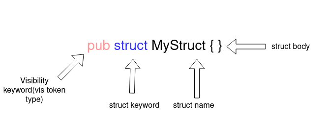
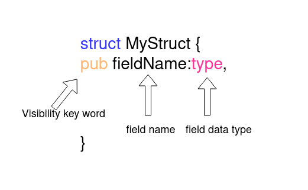

如何使用 Rust 宏

原文：https://blog.logrocket.com/macros-in-rust-a-tutorial-with-examples/

在本教程中，我们将介绍关于 Rust 宏的所有知识，包括 Rust 宏的介绍，并通过实例演示如何使用 Rust 宏。

文章会介绍以下内容：
- Rust 宏是什么？
- Rust 宏的类型
- Rust 宏的声明
  - 创建声明式宏
  - Rust 中声明式宏的高级解析
  - 从 struct 中解析元数据
  - 声明式宏的限制

- Rust 中的过程宏
  - 类属性宏
  - 自定义继承宏
  - 类函数宏

## Rust 宏是什么？

Rust 对宏有很好的支持。宏可以通过一种代码来生成另一种代码，这被称为元编程（metaprogramming）。

宏提供了类似于函数的功能，但没有运行时的成本。然而，有一些编译时的成本，因为宏在编译时被扩展。

Rust 的宏与 C 语言中的宏有很大不同，Rust 的宏是应用于词法树，而 C 语言的宏只是文本替换。

## Rust 宏的类型

Rust 有 2 种类型的宏：

1. **声明式宏** （Declarative macros）使你能够编写类似于 match 表达式的东西，对你提供的作为参数的 Rust 代码进行操作。它使用你提供的代码来生成取代宏调用的代码

2. **过程宏** （Procedural macros）允许你对它所给的 Rust 代码的抽象语法树（AST）进行操作。一个 proc 宏是一个从一个`TokenStream'（或两个）到另一个`TokenStream'的函数，其中的输出取代了宏的调用

让我们仔细了解声明式宏和过程式宏，并探索如何在 Rust 中使用宏的示例。

## 声明式宏

这些宏使用`macro_rules!`声明。声明式宏的功能稍弱一些，但提供了一个易于使用的接口，用于创建宏以删除重复的代码。

一个常见的声明式宏是`println!`。声明式宏提供了一个类似于接口的`match`，一旦匹配，宏就会被替换为匹配分支内的代码。

### 创建声明式宏

```rust
// use macro_rules! <name of macro>{<Body>}
macro_rules! add{
 // macth like arm for macro
    ($a:expr,$b:expr)=>{
 // macro expand to this code
        {
// $a and $b will be templated using the value/variable provided to macro
            $a+$b
        }
    }
}

fn main(){
  // call to macro, $a=1 and $b=2
  add!(1,2);
}
```

这段代码创建了一个宏：2 个数相加。我们使用 [`macro_rules!`](https://doc.rust-lang.org/rust-by-example/macros.html)  来定义宏，宏的名称是 `add`。

这个宏并没有把两个数字相加，它只是把自己替换成加两个数字的代码。宏的每个分支都需要一个函数参数，并且可以为参数指定多种类型。如果 `add` 只接受一个参数，我们可以添加其他分支。

```rust
macro_rules! add{
 // first arm match add!(1,2), add!(2,3) etc
    ($a:expr,$b:expr)=>{
        {
            $a+$b
        }
    };
// Second arm macth add!(1), add!(2) etc
    ($a:expr)=>{
        {
            $a
        }
    }
}

fn main(){
// call the macro
    let x=0;
    add!(1,2);
    add!(x);
}
```

一个宏中可以有多个分支，根据不同的参数匹配到不同的分支。每个分支可以接受多个参数，参数以`$`作为开头，后面是一个 token 类型：

- `item`  —— 一个项（item），像一个函数，结构体，模块等。

- `block`  —— 一个块（block）（即一个语句块或一个表达式，由花括号所包围）

- `stmt`  ——  一个语句（statement）

- `pat`  —— 一个模式（pattern）

- `expr`  ——  一个表达式（expression）

- `ty`  —— 一个类型（type）

- `ident` ——  一个标识符（indentfier）

- `path`  ——  一个路径（path）（例如，foo，::std::mem::replace，transmute::<_, int>，...）

- `meta`  ——  一个元数据项；位于#[...] 和#![...] 属性

- `tt` —— 一个词法树

- `vis` —— 一个可能为空的 Visibility 限定词

在示例中，我们使用标记类型为 `ty` 的 `$typ` 参数作为数据类型，如 `u8`、`u16` 等。此宏在添加数字之前转换为特定类型。

```rust
macro_rules! add_as{
// using a ty token type for macthing datatypes passed to maccro
    ($a:expr,$b:expr,$typ:ty)=>{
        $a as $typ + $b as $typ
    }
}

fn main(){
  println!("{}",add_as!(0,2,u8));
}
```

Rust 宏也支持接受非固定数量的参数。操作符与正则表达式非常相似。`*`用于零个或多个标记类型，`+`用于零个或一个参数。

```rust
macro_rules! add_as{
    (
  // repeated block
  $($a:expr)
 // seperator
   ,
// zero or more
   *
   )=>{
       {
   // to handle the case without any arguments
   0
   // block to be repeated
   $(+$a)*
     }
    }
}

fn main(){
    println!("{}",add_as!(1,2,3,4)); // => println!("{}",{0+1+2+3+4})
}
```

重复的标记类型包含在`$()`中，后面跟着一个分隔符和一个`*`或`+`，表示该标记将重复的次数。分隔符用于区分不同的标记。`$()`块后跟`*`或`+`用于表示重复的代码块。在上面的例子中，`+$a`是一个重复的代码。

如果你仔细观察，你会发现在代码中加入了一个额外的 0，以使语法有效。为了去除这个零，使`add`表达式与参数相同，我们需要创建一个新的宏，称为[TT muncher](https://danielkeep.github.io/tlborm/book/pat-incremental-tt-munchers.html)。

```rust
macro_rules! add{
 // first arm in case of single argument and last remaining variable/number
    ($a:expr)=>{
        $a
    };
// second arm in case of two arument are passed and stop recursion in case of odd number ofarguments
    ($a:expr,$b:expr)=>{
        {
            $a+$b
        }
    };
// add the number and the result of remaining arguments
    ($a:expr,$($b:tt)*)=>{
       {
           $a+add!($($b)*)
       }
    }
}

fn main(){
  println!("{}",add!(1,2,3,4));
}
```

TT muncher 以递归的方式分别处理每个 token。一次只处理一个 token 是比较容易的。这个宏有三个分支：

1. 如果传递了一个参数，则第一个分支处理这种情况

2. 第二个函数处理传递两个参数的情况

3. 第三个分支使用其他参数再次调用`add`宏

宏参数不需要用逗号分隔。多个令牌可以用于不同的令牌类型。例如，括号可以与 `ident` 标记类型一起使用。Rust 编译器获取匹配的分支，并从参数字符串中提取变量。

```rust
macro_rules! ok_or_return{
// match something(q,r,t,6,7,8) etc
// compiler extracts function name and arguments. It injects the values in respective varibles.
    ($a:ident($($b:tt)*))=>{
       {
        match $a($($b)*) {
            Ok(value)=>value,
            Err(err)=>{
                return Err(err);
            }
        }
        }
    };
}

fn some_work(i:i64,j:i64)->Result<(i64,i64),String>{
    if i+j>2 {
        Ok((i,j))
    } else {
        Err("error".to_owned())
    }
}

fn main()->Result<(),String>{
    ok_or_return!(some_work(1,4));
    ok_or_return!(some_work(1,0));
    Ok(())
}
```

如果一个操作返回 `Err`或者一个操作的值返回 `Ok`，那么`ok_or_return`宏就会返回该函数。它接受一个函数作为参数，并在一个 match 语句中执行它。对于传递给函数的参数，它使用重复的方式。

通常情况下，很少有宏需要组合成一个宏。在这些情况下，要使用内部宏规则。它有助于操作宏的输入，并写出干净的 TT Munchers。

要创建内部规则，需要添加以 `@` 开头的规则名称作为参数。现在，除非明确指定为参数，否则宏将永远不会匹配内部规则。

```rust
macro_rules! ok_or_return{
 // internal rule.
    (@error $a:ident,$($b:tt)* )=>{
        {
        match $a($($b)*) {
            Ok(value)=>value,
            Err(err)=>{
                return Err(err);
            }
        }
        }
    };

// public rule can be called by the user.
    ($a:ident($($b:tt)*))=>{
        ok_or_return!(@error $a,$($b)*)
    };
}

fn some_work(i:i64,j:i64)->Result<(i64,i64),String>{
    if i+j>2 {
        Ok((i,j))
    } else {
        Err("error".to_owned())
    }
}

fn main()->Result<(),String>{
   // instead of round bracket curly brackets can also be used
    ok_or_return!{some_work(1,4)};
    ok_or_return!(some_work(1,0));
    Ok(())
}
```

## 在 Rust 中使用声明式宏进行高级解析

宏有时会执行需要解析 Rust 语言本身的任务。

把我们已经讲过的所有概念放在一起，让我们创建一个宏，通过添加 `pub` 关键字来使 struct 公开。

首先，我们需要解析 Rust struct 以获取 struct 的名称、struct 的字段和字段类型。

### 解析一个 struct 的名称和字段

`struct` 声明的开头有一个可见性关键字（例如 `pub`），后跟 `struct` 关键字，然后是 `struct` 的名称和 `struct` 的主体。



```rust
macro_rules! make_public{
    (
  // use vis type for visibility keyword and ident for struct name
     $vis:vis struct $struct_name:ident { }
    ) => {
        {
            pub struct $struct_name{ }
        }
    }
}
```

`$vis` 具有可见性，`$struct_name`具有一个 struct 名称。要使 struct 公开，我们只需要添加`pub`关键字，并忽略`$vis`变量。



一个`struct`可以包含多个具有相同或不同数据类型和可见性的字段。`ty`标记类型用于数据类型，`vis`用于可见性，而`ident`用于字段名。我们将使用`*`重复来表示零个或多个字段。

```rust
macro_rules! make_public{
    (
     $vis:vis struct $struct_name:ident {
        $(
 // vis for field visibility, ident for field name and ty for field data type
        $field_vis:vis $field_name:ident : $field_type:ty
        ),*
    }
    ) => {
        {
            pub struct $struct_name{
                $(
                pub $field_name : $field_type,
                )*
            }
        }
    }
}
```

### 从 struct 中解析元数据

通常情况下，`struct` 有一些元数据或过程宏，如`#[derive(Debug)]`。这些元数据需要保持原样。使用 `meta` 类型解析这些元数据。

```rust
macro_rules! make_public{
    (
     // meta data about struct
     $(#[$meta:meta])*
     $vis:vis struct $struct_name:ident {
        $(
        // meta data about field
        $(#[$field_meta:meta])*
        $field_vis:vis $field_name:ident : $field_type:ty
        ),*$(,)+
    }
    ) => {
        {
            $(#[$meta])*
            pub struct $struct_name{
                $(
                $(#[$field_meta:meta])*
                pub $field_name : $field_type,
                )*
            }
        }
    }
}
```

`make_public`宏现在已经准备好了。为了看看 `make_public` 是如何工作的，让我们用 Rust Playground 将宏扩展到实际编译的代码中。

```rust
macro_rules! make_public{
    (
     $(#[$meta:meta])*
     $vis:vis struct $struct_name:ident {
        $(
        $(#[$field_meta:meta])*
        $field_vis:vis $field_name:ident : $field_type:ty
        ),*$(,)+
    }
    ) => {

            $(#[$meta])*
            pub struct $struct_name{
                $(
                $(#[$field_meta:meta])*
                pub $field_name : $field_type,
                )*
            }
    }
}

fn main(){
    make_public!{
        #[derive(Debug)]
        struct Name{
            n:i64,
            t:i64,
            g:i64,
        }
    }
}
```

扩展后的代码看起来像这样：

```rust
// some imports

macro_rules! make_public {
    ($ (#[$ meta : meta]) * $ vis : vis struct $ struct_name : ident
     {
         $
         ($ (#[$ field_meta : meta]) * $ field_vis : vis $ field_name : ident
          : $ field_type : ty), * $ (,) +
     }) =>
    {

            $ (#[$ meta]) * pub struct $ struct_name
            {
                $
                ($ (#[$ field_meta : meta]) * pub $ field_name : $
                 field_type,) *
            }
    }
}

fn main() {
  pub struct name {
    pub n: i64,
    pub t: i64,
    pub g: i64,
  }
}
```

## 声明式宏的限制

声明式宏有一些限制。有些是与 Rust 宏本身有关，有些则是声明式宏所特有的：

- 缺少对宏的自动完成和展开的支持

- 声明式宏调式困难

-  修改能力有限

- 更大的二进制

- 更长的编译时间（这一条对于声明式宏和过程宏都存在）

## Rust 中的过程宏

[过程宏](https://blog.logrocket.com/procedural-macros-in-rust/) （Procedural macros）是一种更为高级的宏。过程宏能够扩展 Rust 的现有语法。它接收任意输入并产生有效的 Rust 代码。

过程宏接收一个 `TokenStream` 作为参数并返回另一个 `TokenStream`。过程宏对输入的 `TokenStream` 进行操作并产生一个输出。有三种类型的过程宏：

- 类属性宏（Attribute-like macros）
- 派生宏（Derive macros）
- 类函数宏（Function-like macros）

### 类属性宏

类属性宏使你能够创建一个自定义的属性，将其附加到一个项目上，并允许对该项目进行操作。它也可以接受参数。

```rust
#[some_attribute_macro(some_argument)]
fn perform_task(){
// some code
}
```

在上面代码中，`some_attribute_macros`是一个类属性宏。它操纵着函数`perform_task`。

要写一个类似属性的宏，先用`cargo new macro-demo --lib` 创建一个项目。项目准备好后，更新 `Cargo.toml`，注意 `[lib]`，该项目将会创建过程宏。

```toml
# Cargo.toml
[lib]
proc-macro = true
```

程序性宏是公共函数，接受`TokenStream`作为输入，并返回另一个`TokenStream`。为了编写程序性宏，我们需要编写解析器来解析`TokenStream`。Rust 社区有一个非常好用的工具`syn`，用于解析`TokenStream`。

[syn](https://docs.rs/syn/1.0.53/syn/)提供了一个现成的 Rust 语法解析器能够用于解析 `TokenStream`。你可以通过组合 syn 提供的底层解析器来解析自己的语法。

把 `syn` 和 `quote` 添加到 `Cargo.toml`：

```toml
# Cargo.toml
[dependencies]
syn = {version="1.0.57",features=["full","fold"]}
quote = "1.0.8"
```

现在我们可以在 `lib.rs` 中使用编译器提供的 `proc_macro` 来编写程序性宏，编写一个类属性的宏。一个过程宏包不能导出除过程宏以外的任何东西，并且包中定义的过程宏不能在包本身中使用。

```rust
// lib.rs
extern crate proc_macro;
use proc_macro::{TokenStream};
use quote::{quote};

// using proc_macro_attribute to declare an attribute like procedural macro
#[proc_macro_attribute]
// _metadata is argument provided to macro call and _input is code to which attribute like macro attaches
pub fn my_custom_attribute(_metadata: TokenStream, _input: TokenStream) -> TokenStream {
    // returing a simple TokenStream for Struct
    TokenStream::from(quote!{struct H{}})
}
```

通过创建一个名为`tests`的文件夹并在该文件夹中添加文件`attribute_macro.rs` 来创建一个测试。在这个文件中，我们可以使用类属性宏进行测试。

```rust
// tests/attribute_macro.rs

use macro_demo::*;

// macro converts struct S to struct H
#[my_custom_attribute]
struct S{}

#[test]
fn test_macro(){
// due to macro we have struct H in scope
    let demo=H{};
}
```

然后使用 `cargo test` 命令进行测试。


现在我们了解了程序性宏的基础知识，让我们使用 `syn` 来进行一些高级的`TokenStream` 操作和解析。

为了理解 syn 是如何用来解析和操作的，让我们来看 [syn Github 仓库](https://github.com/dtolnay/syn/blob/master/examples/trace-var/trace-var/src/lib.rs)上的一个示例。这个示例创建了一个 Rust 宏，这个宏可以追踪变量值的变化。

首先，我们需要去验证，宏是如何操作与其所关联的代码的：

```rust
#[trace_vars(a)]
fn do_something(){
  let a=9;
  a=6;
  a=0;
}
```

`trace_vars` 宏接受它需要跟踪的变量名称，并在每次输入变量的值（即 a 更改）时注入一个打印语句。它会跟踪输入变量的值。

首先，解析类属性宏所附加的代码。syn 为 Rust 函数语法提供了一个内置解析器。 `ItemFn` 将解析函数并在语法无效时抛出错误。

```rust
#[proc_macro_attribute]
pub fn trace_vars(_metadata: TokenStream, input: TokenStream) -> TokenStream {
// parsing rust function to easy to use struct
    let input_fn = parse_macro_input!(input as ItemFn);
    TokenStream::from(quote!{fn dummy(){}})
}
```

现在有了解析过的 `input`，我们转向`metadata`。对于 `metadata`，没有内置的解析器，所以我们必须使用`syn`的`parse`模块自己写一个。

```rust
#[trace_vars(a,c,b)] // we need to parse a "," seperated list of tokens
// code
```

为了让 `syn` 工作，我们需要实现 `syn` 提供的 `Parse` trait。 `Punctuated` 用于创建由`,` 分隔的`Indent` 的`vector`。

```rust
struct Args{
    vars:HashSet<Ident>
}

impl Parse for Args{
    fn parse(input: ParseStream) -> Result<Self> {
        // parses a,b,c, or a,b,c where a,b and c are Indent
        let vars = Punctuated::<Ident, Token![,]>::parse_terminated(input)?;
        Ok(Args {
            vars: vars.into_iter().collect(),
        })
    }
}
```

一旦我们实现了 `Parse` trait，我们就可以使用 `parse_macro_input` 宏来解析 `metadata`。

```rust
#[proc_macro_attribute]
pub fn trace_vars(metadata: TokenStream, input: TokenStream) -> TokenStream {
    let input_fn = parse_macro_input!(input as ItemFn);
// using newly created struct Args
    let args= parse_macro_input!(metadata as Args);
    TokenStream::from(quote!{fn dummy(){}})
}
```

我们现在要修改 `input_fn`，以便在变量改变值时添加`println!`。为了添加这个，我们需要过滤出有复制语句的代码，并在该行后插入一个 print 语句。

```rust
impl Args {
    fn should_print_expr(&self, e: &Expr) -> bool {
        match *e {
            Expr::Path(ref e) => {
 // variable shouldn't start wiht ::
                if e.path.leading_colon.is_some() {
                    false
// should be a single variable like `x=8` not n::x=0
                } else if e.path.segments.len() != 1 {
                    false
                } else {
// get the first part
                    let first = e.path.segments.first().unwrap();
// check if the variable name is in the Args.vars hashset
                    self.vars.contains(&first.ident) && first.arguments.is_empty()
                }
            }
            _ => false,
        }
    }

// used for checking if to print let i=0 etc or not
    fn should_print_pat(&self, p: &Pat) -> bool {
        match p {
// check if variable name is present in set
            Pat::Ident(ref p) => self.vars.contains(&p.ident),
            _ => false,
        }
    }

// manipulate tree to insert print statement
    fn assign_and_print(&mut self, left: Expr, op: &dyn ToTokens, right: Expr) -> Expr {
 // recurive call on right of the assigment statement
        let right = fold::fold_expr(self, right);
// returning manipulated sub-tree
        parse_quote!({
            #left #op #right;
            println!(concat!(stringify!(#left), " = {:?}"), #left);
        })
    }

// manipulating let statement
    fn let_and_print(&mut self, local: Local) -> Stmt {
        let Local { pat, init, .. } = local;
        let init = self.fold_expr(*init.unwrap().1);
// get the variable name of assigned variable
        let ident = match pat {
            Pat::Ident(ref p) => &p.ident,
            _ => unreachable!(),
        };
// new sub tree
        parse_quote! {
            let #pat = {
                #[allow(unused_mut)]
                let #pat = #init;
                println!(concat!(stringify!(#ident), " = {:?}"), #ident);
                #ident
            };
        }
    }
}
```

在上面的例子中，`quote` 宏用于模板化和编写 Rust。`#` 用于注入变量的值。

现在我们在`input_fn`上做 DFS，并插入 print。`syn`提供了一个`Fold` trait，可以在任何 `Item` 上实现 DFS。我们只需要修改与我们要操作的标记类型相对应的 trait 方法。

```rust
impl Fold for Args {
    fn fold_expr(&mut self, e: Expr) -> Expr {
        match e {
// for changing assignment like a=5
            Expr::Assign(e) => {
// check should print
                if self.should_print_expr(&e.left) {
                    self.assign_and_print(*e.left, &e.eq_token, *e.right)
                } else {
// continue with default travesal using default methods
                    Expr::Assign(fold::fold_expr_assign(self, e))
                }
            }
// for changing assigment and operation like a+=1
            Expr::AssignOp(e) => {
// check should print
                if self.should_print_expr(&e.left) {
                    self.assign_and_print(*e.left, &e.op, *e.right)
                } else {
// continue with default behaviour
                    Expr::AssignOp(fold::fold_expr_assign_op(self, e))
                }
            }
// continue with default behaviour for rest of expressions
            _ => fold::fold_expr(self, e),
        }
    }

// for let statements like let d=9
    fn fold_stmt(&mut self, s: Stmt) -> Stmt {
        match s {
            Stmt::Local(s) => {
                if s.init.is_some() && self.should_print_pat(&s.pat) {
                    self.let_and_print(s)
                } else {
                    Stmt::Local(fold::fold_local(self, s))
                }
            }
            _ => fold::fold_stmt(self, s),
        }
    }
}
```

`Fold` trait 用于对 `Item` 进行 DFS。它允许你为各种 token 类型使用不同的行为。

现在我们可以使用 `fold_item_fn` 在解析后的代码中注入打印语句。

```rust
#[proc_macro_attribute]
pub fn trace_var(args: TokenStream, input: TokenStream) -> TokenStream {
// parse the input
    let input = parse_macro_input!(input as ItemFn);
// parse the arguments
    let mut args = parse_macro_input!(args as Args);
// create the ouput
    let output = args.fold_item_fn(input);
// return the TokenStream
    TokenStream::from(quote!(#output))
}
```

这个代码示例来自于 [syn 示例仓库](https://github.com/dtolnay/syn/blob/master/examples/trace-var/trace-var/src/lib.rs)，该仓库也是关于过程宏的一个非常好的学习资源。


### 自定义派生宏

Rust 中的自定义派生宏允许自动实现 traits。这些宏使你能够使用 `#[derive(Trait)]` 实现特征。

`syn` 对 `derive` 宏有很好的支持。

```rust
#[derive(Trait)]
struct MyStruct{}
```

To write a custom derive macro in Rust, we can use `DeriveInput` for parsing input to derive macro. We’ll also use the `proc_macro_derive` macro to define a custom derive macro.

要在 Rust 中编写自定义派生宏，我们可以使用 `DeriveInput` 来解析输入以派生宏。我们还将使用 `proc_macro_derive` 宏来定义一个自定义派生宏。

```rust
#[proc_macro_derive(Trait)]
pub fn derive_trait(input: proc_macro::TokenStream) -> proc_macro::TokenStream {
    let input = parse_macro_input!(input as DeriveInput);

    let name = input.ident;

    let expanded = quote! {
        impl Trait for #name {
            fn print(&self) -> usize {
                println!("{}","hello from #name")
           }
        }
    };

    proc_macro::TokenStream::from(expanded)
}
```

使用 syn 可以编写更为高级的过程宏，请查阅 syn 仓库中的[这个示例](https://github.com/dtolnay/syn/blob/master/examples/heapsize/heapsize_derive/src/lib.rs)。


### 类函数宏

类函数宏类似于声明式宏，因为他们都通过宏调用操作符`!`来执行，并且看起来都像是函数调用。它们都作用于圆括号里的代码。

下面是如何在 Rust 中写一个函数式宏：

```rust
#[proc_macro]
pub fn a_proc_macro(_input: TokenStream) -> TokenStream {
    TokenStream::from(quote!(
            fn anwser()->i32{
                5
            }
))
}
```

类似函数的宏不是在运行时执行，而是在编译时执行。它们可以在 Rust 代码中的任何地方使用。类似函数的宏也接受一个`TokenStream` 并返回一个`TokenStream`。

使用过程宏的优势有：

- 使用 `span` 获得更好的错误处理
- 更好的控制输出
- 社区已有 `syn` 和 `quote` 两个 crate
- 比声明式宏更为强大

## 总结

在这篇教程中，我们介绍了 Rust 中宏的基础知识，定义了声明性宏和过程宏，并介绍了如何使用各种语法和社区的 crate 来编写这两种类型的宏。我们还总结了使用每种类型的 Rust 宏的优势。
